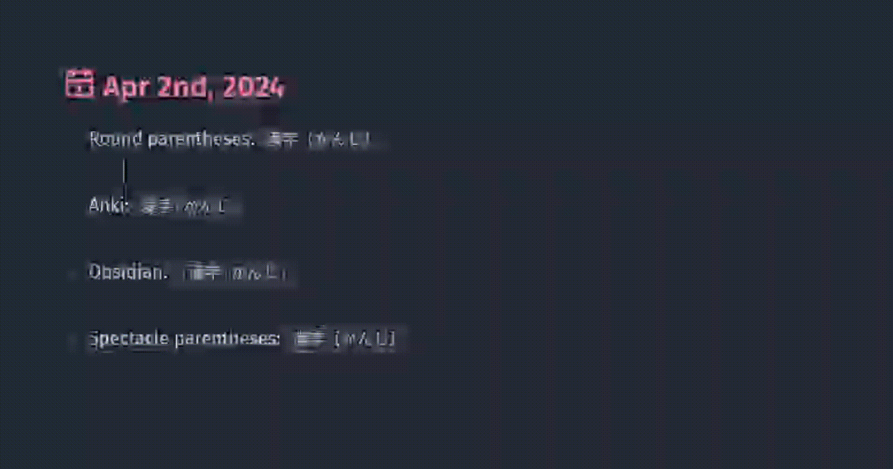

### My other plugins
- 😍 [Logseq Emoji Shortcodes](https://github.com/daviddavo/logseq-emoji-shortcodes)

#  Logseq Furigana

<h3>If you 💜 what I'm doing - you can support my work 🍵</h3>

## Features

Choose if you want to modify your notes or not:

- **Slash command** to transcribe from Markdown Furigana to HTML Ruby tags. 
  - Modifies your notes but you can read them without having the plugin installed.
- **Markdown rendering** to show ruby tags without modifying your notes
  - Just write something like `{漢字|かんじ}` and it will show us as furigana

### Parsers

- There are multiple ways of writing the <ruby>ふりがな<rt>furigana</ruby>:
  - **Round parentheses**: An old classic:  `これは 漢字（かんじ）です`
    - ⚠️ Keep in mind that these are JAPANESE parentheses. You have to use your japanese input method.
  - **Anki** way: Like this `これは 漢字[かんじ]です`
  - **Spectacle parentheses**: `これは 漢字【かんじ】です`
  - **[Obsidian's plugin](https://github.com/steven-kraft/obsidian-markdown-furigana)** way, based on a [markdown-it extension](https://github.com/lostandfound/markdown-it-ruby) (recommended)
    - Uses two brackets to enclose the whole compound: `これは{漢字|かんじ}です`
- You might need to put an space to separate compounds.
- Use extra `|` to show the furigana of each kanji of the word:
  - `漢字[かん|じ] or {漢字|かん|じ}`

## How to develop
1. Clone the repository
2. Make sure you have pnpm installed, [install](https://pnpm.io/installation) if necessary 🛠
3. Execute `pnpm install` 📦
4. Execute `pnpm build` to build the plugin 🚧
5. Enable developer-mode in Logseq, go to plugins, select "Load unpacked plugin" 🔌
6. Select the directory of your plugin (not the `/dist`-directory, but the directory which includes your package.json) 📂
7. Enjoy! 🎉

## Acknowledgments
- Obsidian Furigana Parser based on the [obsidian-markdown-furigana](https://github.com/steven-kraft/obsidian-markdown-furigana) plugin
- Plugin template in [logseq-plugin-template-react](https://github.com/pengx17/logseq-plugin-template-react)
